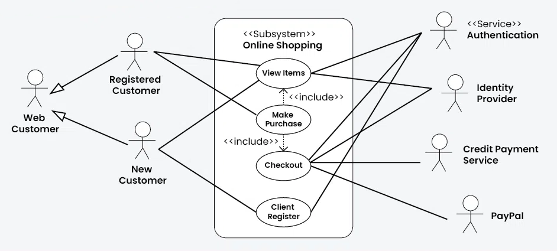
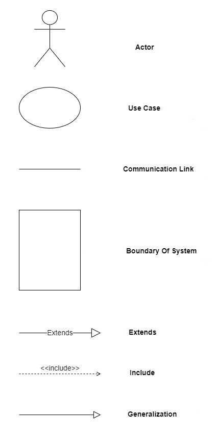

# 02. Le diagramme de Cas d’Utilisation

## Présentation

Le diagramme de cas d'utilisation en UML est un outil essentiel pour représenter les interactions entre un système et
ses utilisateurs (appelés acteurs), et pour identifier les fonctionnalités que le système doit fournir. Il est
généralement utilisé pendant les premières étapes de la phase de définition des exigences, aidant à capturer et à
clarifier les attentes des parties prenantes et à assurer une compréhension commune des fonctionnalités que le système
doit proposer.

## Utilité dans le Développement Logiciel

### Définition des exigences :

Lors de la phase d'analyse, les diagrammes de cas d'utilisation permettent de recueillir et de documenter les exigences
du système, en fournissant une vue d'ensemble des services à offrir aux acteurs impliqués. Cette visualisation aide à
traduire les attentes fonctionnelles en caractéristiques techniques.

### Communication entre équipes :

Ces diagrammes facilitent la communication entre les équipes techniques et les parties prenantes non techniques, car ils
représentent les interactions dans un langage graphique compréhensible pour tous. Ils deviennent alors un outil commun
pour discuter et négocier les fonctionnalités.

### Planification des tests :

Les cas d'utilisation servent aussi de base pour définir les scénarios de test, car ils décrivent les comportements
attendus du système. Ils peuvent aider les équipes de test à planifier et concevoir les tests fonctionnels en couvrant
les différents parcours d'utilisateur.

### Décomposition des tâches :

En identifiant les fonctionnalités du système, les diagrammes de cas d'utilisation aident les gestionnaires de projet à
décomposer les fonctionnalités en tâches plus petites, à les prioriser, et à planifier le travail de développement.

## Symboles et Éléments

### Acteur :

Représenté par une figure de bâton, un acteur peut être une personne, un système ou une organisation qui interagit avec
le système. Chaque acteur est identifié par un nom, et peut participer à un ou plusieurs cas d'utilisation.

### Cas d'utilisation :

Les cas d'utilisation sont représentés par des ovales et décrivent les interactions fonctionnelles du système du point
de vue de l'utilisateur. Chaque cas d'utilisation est identifié par un nom clair et concis.

### Lien d'association :

Les lignes reliant les acteurs aux cas d'utilisation représentent la relation d'interaction. Un acteur peut être associé
à un ou plusieurs cas d'utilisation, et vice-versa.

### Généralisation :

Les relations de généralisation entre acteurs ou entre cas d'utilisation sont représentées par des flèches avec une
pointe non remplie. Elles indiquent qu'un acteur ou un cas d'utilisation hérite du comportement d'un autre.

### Inclusion et Extension :

- **Inclusion (flèche pointillée avec <<include>>) :**
- Signifie qu'un cas d'utilisation intègre un autre cas d'utilisation pour compléter sa fonctionnalité.
- **Extension (flèche pointillée avec <<extend>>) :**
- Indique qu'un cas d'utilisation peut ajouter de nouvelles fonctionnalités conditionnelles à un autre cas
  d'utilisation.

### Cadre de Système ou de Paquetage :

Le cadre est généralement représenté par un rectangle qui englobe les cas d'utilisation pertinents. Sur le bord
supérieur du rectangle, le nom du système ou du paquetage est inscrit, souvent dans une petite "tab" ou étiquette qui
dépasse du rectangle. Ce rectangle aide à visualiser les limites du système ou de la partie du système représenté par
les cas d'utilisation contenus à l'intérieur.

## Exercices pratiques

### [Plateforme de Gestion d'Événements pour Entreprises](..%2FExercices%2F%C3%89nonc%C3%A9%2F02a%20-%20Cas%20d%27Utilisation%20-%20Exercice.md)

### [Système de réservation de bibliothèque en ligne](..%2FExercices%2F%C3%89nonc%C3%A9%2F02b%20-%20Cas%20d%27utilisation%20-%20Exercice.md)
