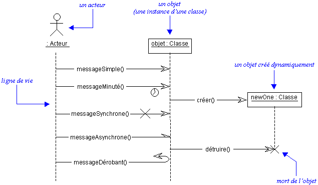
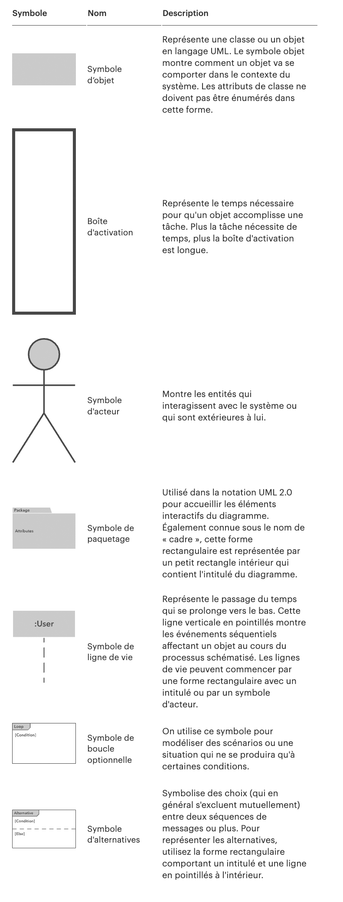
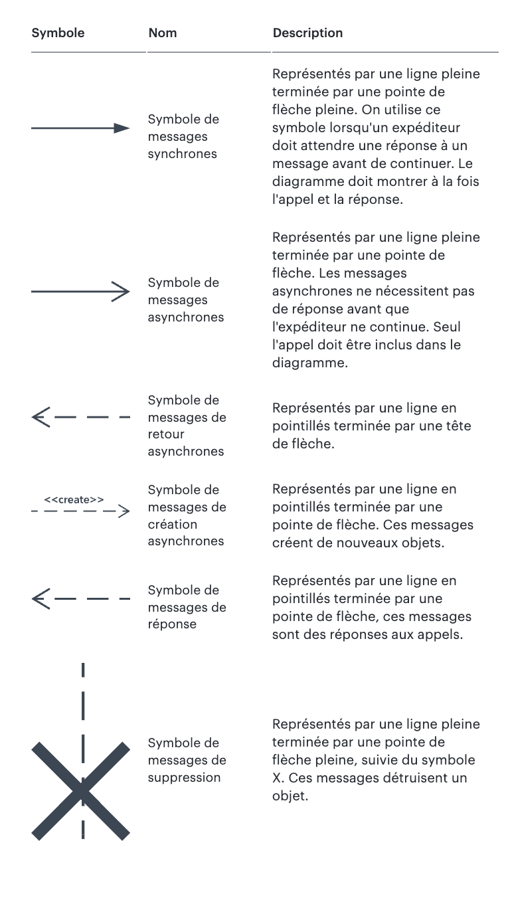

# 04. Le diagramme de Séquence

## Présentation

Le diagramme de séquence en UML est utilisé pour modéliser l'interaction entre les différents objets ou composants d'un
système en montrant la chronologie des messages échangés entre eux. C'est un outil puissant pour visualiser l'ordre
d'exécution des interactions et la manière dont elles s'enchaînent pour réaliser des fonctionnalités spécifiques du
système.

## Utilité dans le Développement Logiciel

### Analyse des exigences :

Ces diagrammes sont utiles pour capturer les exigences fonctionnelles d'une fonctionnalité. Ils aident les analystes
métier, les développeurs, et les parties prenantes à comprendre comment les objets du système interagissent pour
répondre à un besoin particulier.

### Conception technique :

Lors de la phase de conception, les diagrammes de séquence permettent de traduire les exigences en interactions
concrètes entre les différents objets logiciels. Cela aide à planifier la distribution des responsabilités entre les
objets ou classes.

### Documentation :

Ils fournissent une documentation visuelle claire des interactions critiques au sein du système, ce qui permet de
faciliter la compréhension du code pour les nouveaux membres de l'équipe ou les développeurs qui ne connaissent pas tous
les aspects d'une fonctionnalité.

### Débogage et tests :

Lors du débogage ou de la création de tests, ces diagrammes permettent aux testeurs et aux développeurs d'identifier les
étapes à vérifier, en s'assurant que les interactions suivent l'ordre prévu.

## Symboles et Éléments

  

### Ligne de vie :

Représentée par une ligne verticale interrompue par un rectangle au sommet, chaque ligne de vie représente un acteur ou
un objet qui interagit dans la séquence. Le rectangle indique le nom de l'acteur ou de l'objet.

### Message :

Les messages envoyés d'un acteur ou d'un objet à un autre sont représentés par des flèches horizontales ou obliques
reliant les lignes de vie. Les messages synchrones (appels bloquants) sont représentés par une flèche pleine, tandis que
les messages asynchrones (appels non bloquants) utilisent une flèche creuse.

### Activation :

Un rectangle vertical sur une ligne de vie montre la période pendant laquelle l'objet est actif, c'est-à-dire en train
de traiter un message ou une opération.

### Cadre de Fragment :

Un cadre rectangulaire englobe un groupe d'interactions et est utilisé pour décrire des structures de contrôle
complexes. Les types de fragments incluent :

- **Alt (Alternative) :** Equivalent à un bloc if-else.
- **Opt (Optionnel) :** Bloc if simple pour des interactions optionnelles.
- **Loop (Boucle) :** Indique que les interactions doivent se répéter plusieurs fois.
- **Par (Parallèle) :** Indique des interactions pouvant se produire en parallèle.

### Retour :

Une flèche pointillée pointe vers l'arrière pour montrer le retour d'une valeur ou la fin d'une opération.

### Notes :

Des commentaires peuvent être ajoutés au diagramme pour expliquer ou clarifier les interactions.

## Exercices pratiques

### [Distributeur Automatique de Billets (ATM)](..%2FExercices%2F%C3%89nonc%C3%A9%2F04a%20-%20Diagramme%20de%20S%C3%A9quence%20-%20Exercice.md)

### [Programmation d'une Conférence](..%2FExercices%2F%C3%89nonc%C3%A9%2F04b%20-%20Diagramme%20de%20S%C3%A9quence%20-%20Exercice.md)
