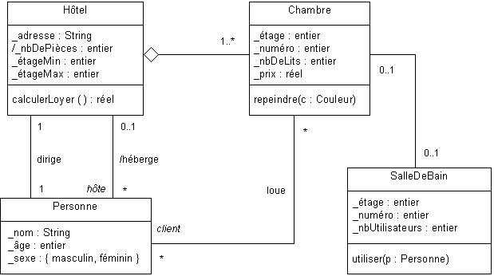
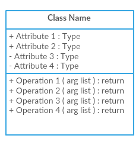

# 05. Le diagramme de Classes



## Notions avancées en POO

### Le polymorphisme

Le polymorphisme est un principe clé de la programmation orientée objet (POO) qui permet aux objets de différentes
classes de répondre à la même action, chaque objet traitant l'action d'une manière appropriée à son type. Ce concept
repose sur trois aspects fondamentaux : les interfaces, l'abstraction, et la concrétisation.

- **Interfaces :**
  En POO, une interface est une déclaration de méthodes sans implémentations, agissant comme un contrat que les classes
  implémentantes doivent respecter. Les interfaces permettent à des classes de types très différents de s'interfacer de
  manière uniforme avec le reste du système.
- **Abstraction :**  
  Le polymorphisme favorise l'abstraction en permettant l'utilisation de types plus généraux (comme les types de base
  dans une hiérarchie de classes ou les interfaces) pour manipuler des objets. Cela permet aux développeurs de
  programmer en termes d'interfaces ou de classes abstraites tout en laissant le système décider de l'objet spécifique à
  créer et à utiliser en fonction du contexte.
- **Concrétisation :**  
  Cela se produit lorsque des classes concrètes implémentent les méthodes définies par leurs interfaces ou classes
  abstraites. La concrétisation est l'acte de définir le comportement spécifique des méthodes abstraites ou des
  interfaces, fournissant ainsi une implémentation réelle aux opérations abstraites.

#### Exemple sans polymorphisme

Imaginons que nous ayons deux types de formes, un rectangle et un cercle, et que nous voulions calculer et afficher
leurs aires. Sans utiliser le polymorphisme, nous devons traiter chaque forme séparément avec des fonctions spécifiques.

```php
<?php

// Classe Dog
class Dog {
    public function speak() {
        return "Woof!";
    }
}

// Classe Cat
class Cat {
    public function speak() {
        return "Meow!";
    }
}

// Fonctions pour faire parler les animaux
function makeDogSpeak(Dog $dog) {
    echo "Dog says: " . $dog->speak() . "\n";
}

function makeCatSpeak(Cat $cat) {
    echo "Cat says: " . $cat->speak() . "\n";
}

// Utilisation des classes et fonctions
$dog = new Dog();
$cat = new Cat();

makeDogSpeak($dog); // Dog says: Woof!
makeCatSpeak($cat); // Cat says: Meow!
```

#### Exemple avec polymorphisme

Utilisons maintenant le polymorphisme pour simplifier le code. Nous allons créer une classe de base Shape avec une
méthode abstraite area() que chaque sous-classe devra implémenter.

```php
<?php

// Classe de base
abstract class Animal {
    // Méthode abstraite
    abstract public function speak();
}

// Classe dérivée : Dog
class Dog extends Animal {
    public function speak() {
        return "Woof!";
    }
}

// Classe dérivée : Cat
class Cat extends Animal {
    public function speak() {
        return "Meow!";
    }
}

// Utilisation du polymorphisme
function makeAnimalSpeak(Animal $animal) {
    echo get_class($animal) . " says: " . $animal->speak() . "\n";
}

// Utilisation des classes avec polymorphisme
$dog = new Dog();
$cat = new Cat();

makeAnimalSpeak($dog); // Dog says: Woof!
makeAnimalSpeak($cat); // Cat says: Meow!
```

#### Comparaison des deux approches

1. Sans polymorphisme :
    - Nous devons écrire des fonctions spécifiques pour chaque type d'animal.
    - Le code n'est pas facilement extensible si nous voulons ajouter de nouveaux animaux.
    - La gestion de chaque animal est dispersée, rendant le code plus difficile à maintenir.

2. Avec polymorphisme :
    - Nous avons une interface commune (Animal) pour tous les animaux.
    - La méthode `speak()` est implémentée spécifiquement dans chaque sous-classe.
    - Le code est plus propre, plus extensible et plus facile à maintenir.
    - Une seule fonction `makeAnimalSpeak()` peut traiter tous les animaux.

#### Exemple amélioré avec une interface

Créons une interface Speakable qui déclare la méthode `speak()`. Ensuite, nous implémenterons cette interface dans nos
classes `Dog` et `Cat`.

```php
<?php

// Interface Speakable
interface Speakable {
    public function speak();
}

// Classe Dog implémentant l'interface Speakable
class Dog implements Speakable {
    public function speak() {
        return "Woof!";
    }
}

// Classe Cat implémentant l'interface Speakable
class Cat implements Speakable {
    public function speak() {
        return "Meow!";
    }
}

// Utilisation du polymorphisme avec l'interface
function makeAnimalSpeak(Speakable $animal) {
    echo get_class($animal) . " says: " . $animal->speak() . "\n";
}

// Utilisation des classes avec polymorphisme et interface
$dog = new Dog();
$cat = new Cat();

makeAnimalSpeak($dog); // Dog says: Woof!
makeAnimalSpeak($cat); // Cat says: Meow!
```

### Comparaison avec et sans interface

1. Sans interface :
    - Le polymorphisme est basé sur une classe abstraite.
    - Les classes dérivées doivent hériter de cette classe abstraite.

2. Avec interface :
    - Le polymorphisme est basé sur une interface.
    - Les classes peuvent implémenter plusieurs interfaces, ce qui n'est pas possible avec les classes abstraites.
    - L'interface définit un contrat clair que toutes les classes doivent suivre.

#### Avantages d'utiliser une interface

- **Flexibilité** : Une classe peut implémenter plusieurs interfaces, permettant ainsi un polymorphisme plus flexible.
- **Clarté** : L'interface définit un contrat clair que toutes les classes doivent suivre, ce qui rend le code plus
  lisible et compréhensible.
- **Modularité** : Facilite l'ajout de nouvelles classes qui respectent le même contrat sans modifier les classes
  existantes.

#### Conclusion

Le polymorphisme permet de traiter des objets de différents types de manière uniforme, simplifiant le code et le rendant
plus modulaire et extensible. En utilisant le polymorphisme, nous pouvons facilement ajouter de nouveaux types d'animaux
sans avoir à modifier les fonctions existantes.

### L'encapsulation

L'encapsulation est un mécanisme de restriction de l'accès direct aux composants d'un objet, ce qui protège l'intégrité
des données de l'objet en empêchant des interférences extérieures ou une utilisation incorrecte.

- **Protection des données :**  
  Les attributs d'un objet sont cachés et seulement accessibles via des méthodes définies dans la classe (souvent
  appelées getters et setters). Cela assure que les données internes ne peuvent pas être changées arbitrairement,
  imposant un contrôle strict sur la manière dont les données essentielles sont modifiées et consultées.
- **Contrôle de l'accès :**  
  L'encapsulation utilise des modificateurs d'accès tels que public, private, et protected pour contrôler comment les
  membres de données sont visibles à l'extérieur de la classe. Les méthodes publiques fournissent une interface avec
  l'extérieur, tandis que les détails internes restent privés, permettant à la classe de garantir qu'aucun comportement
  erroné ne soit induit par des changements inattendus dans son état interne.
- **Cohérence et validation :**  
  En encapsulant les données, les classes peuvent forcer des règles de validation sur les données entrantes,
  garantissant que l'objet reste dans un état valide. Par exemple, si une classe CompteBancaire a un attribut solde, le
  setter pour ce solde peut vérifier que les fonds ne sont pas définis à une valeur négative.

L'encapsulation et le polymorphisme sont des piliers de la POO qui permettent de construire des systèmes plus fiables,
modulaires et évolutifs. Ces mécanismes aident à gérer la complexité et à augmenter la réutilisabilité du code, tout en
améliorant la maintenance et la flexibilité des logiciels.

#### Exemple sans encapsulation en PHP

```php
<?php

class Dog {
    public $name;
    public $breed;

    public function __construct($name, $breed) {
        $this->name = $name;
        $this->breed = $breed;
    }

    public function speak() {
        return "Woof!";
    }
}

$dog = new Dog("Buddy", "Golden Retriever");
echo $dog->name . " says " . $dog->speak() . "\n"; // Buddy says Woof!
echo "Breed: " . $dog->breed . "\n"; // Breed: Golden Retriever

// Direct access to properties
$dog->name = "Max";
echo $dog->name . " says " . $dog->speak() . "\n"; // Max says Woof!
```

#### Exemple avec encapsulation en PHP

```php
<?php

class Dog {
    private $name;
    private $breed;

    public function __construct($name, $breed) {
        $this->setName($name);
        $this->setBreed($breed);
    }

    public function setName($name) {
        if (!empty($name)) {
            $this->name = $name;
        } else {
            throw new Exception("Name cannot be empty");
        }
    }

    public function getName() {
        return $this->name;
    }

    public function setBreed($breed) {
        if (!empty($breed)) {
            $this->breed = $breed;
        } else {
            throw new Exception("Breed cannot be empty");
        }
    }

    public function getBreed() {
        return $this->breed;
    }

    public function speak() {
        return "Woof!";
    }
}

$dog = new Dog("Buddy", "Golden Retriever");
echo $dog->getName() . " says " . $dog->speak() . "\n"; // Buddy says Woof!
echo "Breed: " . $dog->getBreed() . "\n"; // Breed: Golden Retriever

// Trying to change the name directly will not work
//$dog->name = "Max"; // Error
$dog->setName("Max");
echo $dog->getName() . " says " . $dog->speak() . "\n"; // Max says Woof!
```

#### Comparaison avec et sans encapsulation

1. Sans encapsulation :
    - Les propriétés de la classe sont accessibles directement, ce qui peut mener à des modifications involontaires ou
      incorrectes des données internes.
    - Le code est moins sécurisé et moins maintenable.

2. Avec encapsulation :
    - Les propriétés de la classe sont privées et accessibles uniquement via des méthodes publiques (getter et setter).
    - Cela permet de contrôler et de valider les modifications des données internes.
    - Le code est plus sécurisé, maintenable et respecte le principe d'encapsulation de la POO.

### Les principes S.O.L.I.D.

Les principes SOLID sont un ensemble de cinq principes de conception orientée objet qui visent à rendre le code plus
compréhensible, flexible et maintenable. Voici une explication détaillée de chaque principe :

#### Single Responsibility Principle (SRP)

- **Principe :** Une classe ne devrait avoir qu'une seule responsabilité, c'est-à-dire une seule raison de changer.
- **Explication :** Cela signifie que chaque classe doit se concentrer sur une seule tâche ou fonctionnalité. En suivant
  ce principe, le code devient plus facile à comprendre, à tester et à maintenir, car les changements dans une
  fonctionnalité n'affectent pas les autres.
- **Exemple :** Si une classe Report gère à la fois la génération de rapports et l'envoi de courriels, elle ne respecte
  pas le SRP. Il serait préférable de séparer ces responsabilités en deux classes distinctes, ReportGenerator et
  EmailSender.

#### Open/Closed Principle (OCP)

- **Principe :** Les entités du logiciel (classes, modules, fonctions, etc.) devraient être ouvertes à l'extension mais
  fermées à la modification.
- **Explication :** Cela signifie que le comportement d'une classe peut être étendu sans modifier son code source. Ce
  principe favorise l'utilisation de l'héritage ou de l'implémentation des interfaces pour ajouter de nouvelles
  fonctionnalités.
- **Exemple :** Si une classe Shape a des sous-classes Circle et Square, vous pouvez ajouter une nouvelle sous-classe
  Triangle sans modifier le code existant de Shape.

#### Liskov Substitution Principle (LSP)

- **Principe :** Les objets d'une classe dérivée doivent pouvoir être remplacés par des objets de la classe de base sans
  affecter la fonctionnalité du programme.
- **Explication :** Cela signifie que les sous-classes doivent être substituables à leurs classes de base sans que le
  code client ne doive connaître la différence. Pour respecter ce principe, les sous-classes ne doivent pas altérer le
  comportement attendu des méthodes de la classe de base.
- **Exemple :** Si une classe Bird a une méthode fly(), toutes les sous-classes comme Sparrow ou Eagle doivent pouvoir
  être utilisées sans problème à la place de Bird. Cependant, une sous-classe comme Penguin qui ne peut pas voler
  violerait ce principe.

#### Interface Segregation Principle (ISP)

- **Principe :** Les clients ne devraient pas être forcés à dépendre d'interfaces qu'ils n'utilisent pas.
- **Explication :** Cela signifie qu'il est préférable de créer plusieurs interfaces spécifiques à des clients plutôt
  qu'une seule interface générale. Ainsi, les classes n'implémentent que les méthodes dont elles ont besoin.
- **Exemple :** Si une interface Worker a des méthodes work() et eat(), une classe Robot qui implémente Worker ne
  devrait pas être obligée d'implémenter eat(). Il serait mieux de diviser l'interface en Workable avec la méthode
  work() et Eatable avec la méthode eat().

#### Dependency Inversion Principle (DIP)

- **Principe :** Les modules de haut niveau ne doivent pas dépendre des modules de bas niveau. Les deux doivent dépendre
  des abstractions. Les abstractions ne doivent pas dépendre des détails. Les détails doivent dépendre des abstractions.
- **Explication :** Cela signifie que les classes de haut niveau (qui contiennent la logique d'application) ne doivent
  pas dépendre des classes de bas niveau (qui contiennent les détails de l'implémentation). Les deux devraient dépendre
  d'abstractions comme des interfaces ou des classes abstraites. Ce principe favorise l'injection de dépendances pour
  inverser le contrôle de l'instanciation des objets.
- **Exemple :** Si une classe Service dépend d'une classe Repository, il est préférable de créer une interface
  IRepository que Service utilisera. Ainsi, Service dépend de l'abstraction IRepository, et vous pouvez facilement
  changer l'implémentation concrète de Repository sans modifier Service.

## Présentation

Le diagramme de classes est un élément central de la modélisation UML, fournissant une vue structurée du système. Il
définit la structure des classes du logiciel, leurs attributs, leurs méthodes, ainsi que les relations qu'elles
entretiennent entre elles. Ce diagramme joue un rôle crucial dans la conception orientée objet, permettant aux
architectes logiciels de planifier la manière dont le système est organisé.

## Utilité dans le Développement Logiciel

### Conception Orientée Objet :

Les diagrammes de classes facilitent la modélisation des concepts réels sous forme de classes, aidant les développeurs à
visualiser les objets du système et leurs relations. Ils constituent une base solide pour l'implémentation des principes
SOLID.

### Documentation :

Ils fournissent une documentation visuelle des classes, des attributs, et des méthodes, ce qui simplifie la
compréhension du code par les développeurs qui rejoignent le projet ou qui en prennent la maintenance.

### Optimisation et Refactorisation :

Le diagramme aide les développeurs à identifier les duplications ou les dépendances excessives entre les classes, ce qui
facilite la refactorisation et l'amélioration continue du design.

### Collaboration d'Équipe :

Le diagramme de classes sert de langage commun entre les architectes, les développeurs et les autres parties prenantes,
en alignant les attentes et les objectifs dès la phase de conception.

## Symboles et Éléments




### Classe :

Une classe est représentée par un rectangle à trois compartiments. Le compartiment supérieur affiche le nom de la
classe. Le compartiment central contient les attributs (propriétés). Le compartiment inférieur liste les méthodes (
opérations).

### Attribut :

Un attribut est un champ dans une classe, typiquement sous la forme : visibilité nom: type. Par exemple, +nom: String
représente un attribut public nommé "nom" de type chaîne de caractères.

### Méthode :

Les méthodes (opérations) sont définies de la même manière : visibilité nom(paramètres): type. Par exemple,
+calculerSalaire(): double représente une méthode publique sans paramètres, qui retourne un double.

### Visibilité :

Les symboles précédant les attributs et méthodes indiquent la visibilité :

- `+` **Public :** Accessible depuis n'importe quelle autre classe ou composant du programme. Cela signifie qu'aucune
  restriction n'est imposée à l'accès ou à l'utilisation de l'élément.
- `#` **Protégé :** Accessible uniquement par les classes qui sont des descendants (sous-classes) de la classe où
  l'élément protégé est déclaré. Cela permet un accès plus restreint que le public, protégeant l'élément des accès
  extérieurs tout en permettant son utilisation par les classes dérivées.
- `-` **Privé :** L'accès est strictement limité à la classe dans laquelle l'élément est déclaré. Aucune autre classe,
  même une sous-classe, ne peut accéder à cet élément directement. Cela est utilisé pour cacher les détails
  d'implémentation de la classe et encourager l'encapsulation.
- `~` **Package :** Accessible uniquement par les classes qui sont dans le même paquet. Ce niveau de visibilité est
  utilisé pour contrôler l'accès au sein d'un même regroupement logique de classes qui travaillent ensemble de manière
  interne, sans exposer l'élément au-delà des frontières du paquet.
- `/` **Dérivé :** Indique que l'attribut n'est pas stocké directement mais calculé ou dérivé d'autres attributs ou
  relations. Les attributs dérivés sont souvent marqués par une barre oblique pour indiquer qu'ils sont le résultat d'
  une opération ou d'une méthode spécifique. Par exemple, un attribut âge pourrait être dérivé de la date de naissance.
- `souligné` **Statique :** Indique que l'élément (attribut ou méthode) appartient à la classe elle-même plutôt qu'à une
  instance spécifique de la classe. Cela signifie que l'élément est partagé entre toutes les instances de la classe. En
  UML, un nom souligné signifie que l'élément est statique.

### Relation :

- **Association :**  
  Une connexion générale entre deux classes, indiquant une relation bidirectionnelle ou unidirectionnelle.  
  Exemple : Une Personne peut avoir une association avec Voiture, indiquant qu'une personne possède une voiture.

- **Agrégation :**  
  Une forme spéciale d'association qui représente une relation "tout-partie" où la partie peut exister indépendamment du
  tout.  
  Exemple : Entreprise et Employé, où les employés peuvent exister séparément de l'entreprise.

- **Composition :**  
  Une forme plus forte d'agrégation où la partie ne peut pas exister sans le tout.   
  Exemple : Moteur est une partie essentielle de Voiture.

- **Héritage :**  
  Une relation où une classe (sous-classe ou classe dérivée) hérite des caractéristiques d'une autre classe (
  super-classe
  ou classe parente).  
  Exemple : VoitureElectrique héritant de Voiture, reprenant ses attributs et méthodes tout en ajoutant les siens.

- **Réalisation :**  
  La réalisation ou mise en œuvre spécifie qu'une classe réalise l'ensemble des méthodes définies dans une interface. La
  notion de mise en œuvre dans le contexte d'un diagramme de classes UML fait référence à la façon dont une classe
  concrétise ou réalise la fonctionnalité définie dans une autre classe ou une interface : une classe peut mettre en
  œuvre les méthodes et les comportements définis dans une autre classe. Cela signifie qu'elle fournit une
  implémentation pratique pour ces fonctionnalités.  
  Exemple : La classe Voiture peut réaliser une interface IVehicule qui définit des méthodes comme conduire() et
  stationner(). Les méthodes seront simplement définies dans l'interface, tandis que le code exécutant les actions sera
  écrit dans la classe qui l'implémente.

- **Implémentation :**  
  Se réfère souvent à l'action d'une classe concrète exécutant les méthodes d'une interface. Lorsque l'on parle de mise
  en œuvre dans un diagramme de classes UML, cela fait généralement référence à l'implémentation d'interfaces ou de
  contrats définis dans une classe par une autre classe. Les interfaces sont des contrats abstraits qui spécifient les
  méthodes que les classes concrètes doivent implémenter. Dans ce contexte, une classe qui implémente une interface
  s'engage à fournir une implémentation concrète pour les méthodes déclarées dans cette interface.  
  Exemple : Voiture implémentant l'interface IVehicule.

- **Dépendance :**  
  Une dépendance est une relation où une classe dépend d'une autre pour fonctionner, mais cette dépendance est
  généralement de courte durée ou moins formelle.  
  Exemple : La classe Conducteur peut avoir une dépendance à la classe Voiture pour sa méthode conduire().

## Exercices pratiques

### [Système de réservation de bibliothèque en ligne](..%2FExercices%2F%C3%89nonc%C3%A9%2F05a%20-%20Diagramme%20de%20Classes%20-%20Exercice.md)

### [Plateforme de Gestion d'Événements](..%2FExercices%2F%C3%89nonc%C3%A9%2F05b%20-%20Diagramme%20de%20Classes%20-%20Exercice.md)
