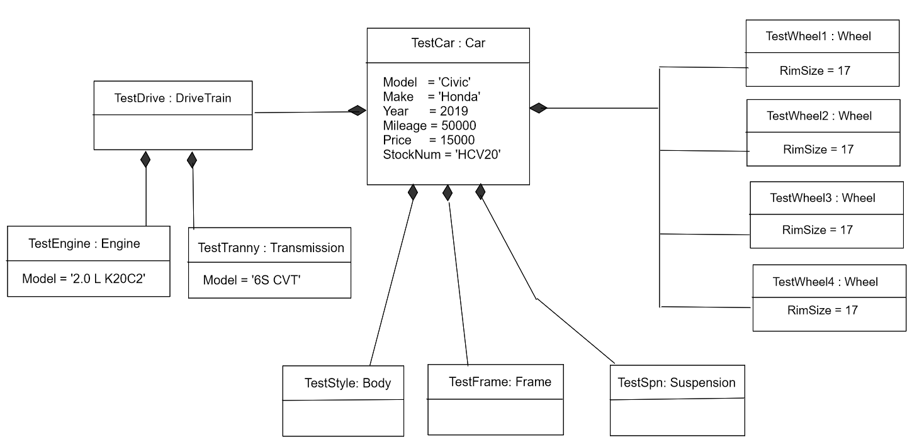
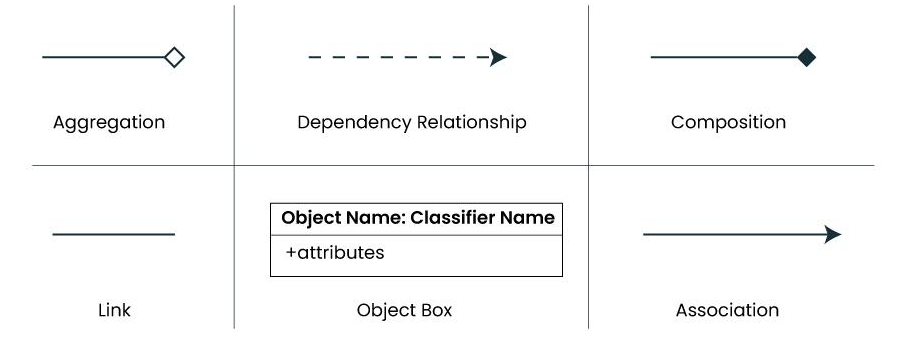
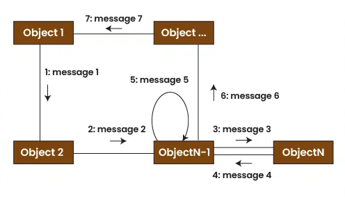
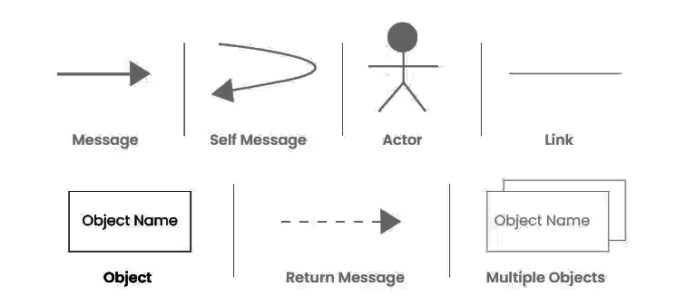
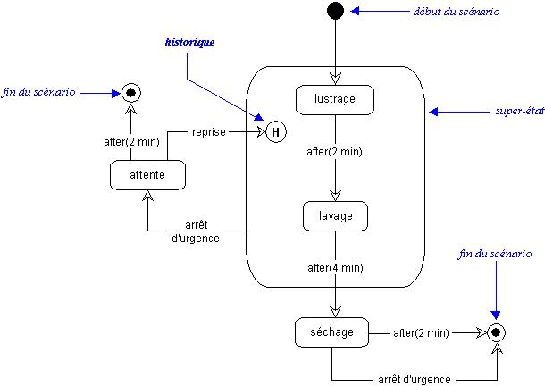
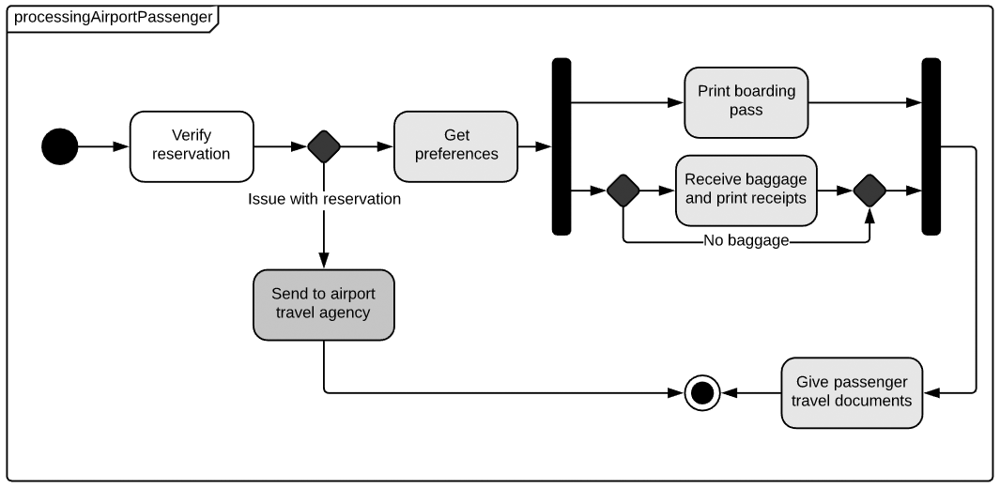

# 06. Les diagrammes d'Objets

## 06a. Le diagramme d'Objets

### Présentation

Les diagrammes d'objets en UML représentent une instance statique des objets dans un système à un moment donné.
Contrairement aux diagrammes de classes, qui montrent la structure abstraite du système, les diagrammes d'objets mettent
en lumière les instances réelles des classes, leurs attributs et les relations entre elles. Ils sont souvent utilisés
pour valider ou illustrer les modèles de classes, en fournissant une représentation plus concrète et précise des objets
manipulés.

### Utilité dans le Développement Logiciel

#### Validation de la Structure des Classes :

Les diagrammes d'objets aident à valider le design des diagrammes de classes. En modélisant les instances réelles, on
peut voir si la structure abstraite des classes fonctionne en pratique. Cela permet d'identifier les erreurs de
conception ou les incohérences dans la structure.

#### Représentation de Scénarios Spécifiques :

Ils sont utiles pour illustrer des scénarios spécifiques de fonctionnement du système, comme la configuration d'une
fonctionnalité donnée ou le traitement d'une transaction. Par exemple, pour un système bancaire, un diagramme d'objets
peut montrer comment les comptes et les clients interagissent pour une opération de transfert.

#### Communication entre Parties Prenantes :

Les diagrammes d'objets offrent un moyen clair et concis de communiquer des modèles conceptuels complexes aux parties
prenantes non techniques, en montrant comment le système interagit avec ses différents composants dans des situations
réelles.

### Symboles et Éléments

#### Objets :

Les objets sont représentés par un rectangle, comme les classes, mais leur nom est souligné pour indiquer qu'il s'agit
d'une instance. Ils sont généralement nommés selon le format nomObjet:nomClasse (par exemple, client1:Client).

#### Attributs :

Les attributs des objets peuvent être affichés à l'intérieur du rectangle de l'objet, montrant les valeurs spécifiques
détenues par cette instance particulière.

#### Liens (Associations) :

Les liens entre objets représentent les relations d'association entre les instances des classes et sont représentés par
des lignes. Ces lignes peuvent être nommées selon l'association qu'elles représentent, et les rôles peuvent être
indiqués au-dessus de chaque extrémité.

#### Multiplicité :

Les multiplicités, identiques à celles des diagrammes de classes, sont placées aux extrémités des lignes pour indiquer
combien d'instances d'un objet peuvent être associées à une instance d'un autre objet.

#### Composition et Agrégation :

Les liens peuvent aussi représenter des relations de composition (losange plein) ou d'agrégation (losange vide),
montrant la hiérarchie des parties et du tout entre les objets.

## 06b. Le diagramme de Collaboration

### Présentation

Les diagrammes de collaboration en UML, également appelés diagrammes de communication, sont utilisés pour représenter
les interactions entre les objets ou composants dans un système, en se concentrant sur la structure organisationnelle
des collaborations. Ils combinent les informations d'un diagramme de séquence et d'un diagramme de structure, montrant à
la fois l'ordre des interactions et les relations structurelles entre les entités.

### Utilité dans le Développement Logiciel

#### Analyse de la Communication :

Les diagrammes de collaboration aident à comprendre comment les objets communiquent et interagissent dans le système.
Ils montrent quelles méthodes sont invoquées et dans quel ordre, fournissant un aperçu clair de l'orchestration des
tâches entre les différents éléments.

#### Optimisation des Interactions :

En identifiant les dépendances et les chemins d'appel, ces diagrammes permettent d'optimiser les interactions, réduisant
les goulots d'étranglement ou les communications redondantes. Cela facilite également la conception d'une architecture
efficace et minimise les dépendances complexes.

#### Documentation et Formation :

Les diagrammes de collaboration offrent une documentation utile pour les nouveaux membres de l'équipe de développement,
les aidant à comprendre rapidement le comportement des objets dans différents scénarios et à se familiariser avec la
structure des composants.

### Symboles et Éléments

#### Objets :

Les objets ou instances de classes sont représentés par des rectangles avec leur nom souligné, généralement au format
nomObjet:nomClasse.

#### Liens :

Les lignes reliant les objets représentent les relations entre eux, indiquant quelles méthodes ou messages sont
échangés.

#### Messages Numérotés :

Les messages entre objets sont représentés par des flèches numérotées, ce qui indique l'ordre dans lequel ils sont
échangés. Le numéro d'un message peut être imbriqué pour refléter les appels de méthode dans d'autres méthodes.

#### Messages Conditionnels :

Les messages peuvent être conditionnels, avec une condition indiquée entre crochets avant le numéro du message. Cela
signifie que le message n'est envoyé que si la condition est remplie.

#### Messages Répétitifs :

Des messages peuvent également être envoyés de manière répétitive, indiqués par un astérisque (*) et une condition de
boucle entre crochets. Par exemple, [*] message1 signifie que message1 est envoyé en boucle.

## 06c. Le diagramme État / Transition

### Présentation

Le diagramme État / Transition (ou diagramme d'états) est un outil de modélisation utilisé en ingénierie logicielle pour
représenter les différents états qu'un objet ou un système peut traverser au cours de son cycle de vie, ainsi que les
transitions entre ces états. Ce type de diagramme est particulièrement utile pour les systèmes réactifs, où les objets
répondent à des événements en passant d'un état à un autre.

### Utilité dans le développement logiciel

- Décrire le comportement dynamique d'un objet ou d'un système.
- Illustrer les états possibles d'un objet et les conditions de transition entre ces états.
- Faciliter la compréhension des flux de contrôle et des réactions aux événements.
- Modélisation des machines à états finis.
- Développement de systèmes embarqués et réactifs.
- Conception d'interfaces utilisateur.
- Définition des comportements dans les protocoles de communication.

### Symboles et Éléments

#### État :

- **Représentation :** Un état est représenté par un rectangle aux coins arrondis.
- **Description :** Chaque état correspond à une situation ou condition particulière dans laquelle l'objet peut se
  trouver.
- **Notation :**
    - Nom de l'état inscrit à l'intérieur du rectangle.
    - Optionnellement, les actions ou activités associées à cet état peuvent être mentionnées.

#### État Initial :

- **Représentation :** Un cercle plein noir.
- **Description :** Indique le point de départ ou l'état initial du système ou de l'objet avant que tout événement ne se
  produise.

#### État Final :

- **Représentation :** Un cercle noir entouré d'un cercle blanc.
- **Description :** Indique l'état final ou terminal, signifiant que l'objet ou le système a atteint une condition de
  fin.

#### Transition :

- **Représentation :** Une flèche allant d'un état à un autre.
- **Description :** Représente le passage d'un état à un autre en réponse à un événement ou à une condition
  particulière.
- **Notation :**
    - Étiquette sur la flèche indiquant l'événement déclencheur, la condition de garde (facultatif), et/ou l'action
      associée.

#### État Composite :

- **Représentation :** Un grand rectangle aux coins arrondis contenant d'autres états et transitions.
- **Description :** Utilisé pour représenter des états qui contiennent d'autres sous-états, permettant de modéliser des
  comportements plus complexes et hiérarchisés.

#### Junction (Jonction) :

- **Représentation :** Un petit cercle noir.
- **Description :** Utilisé pour séparer une transition en plusieurs segments ou pour joindre plusieurs transitions en
  un seul point.

#### Choice (Choix) :

- **Représentation :** Un losange.
- **Description :** Utilisé pour modéliser des décisions où une transition peut prendre plusieurs chemins en fonction de
  certaines conditions.

#### Fork / Join (Fourche / Jonction) :

- **Fork :**
    - **Représentation :** Une ligne noire épaisse partant d'un seul état et se divisant en plusieurs transitions
      parallèles.
    - **Description :** Utilisée pour indiquer la décomposition d'un flux en plusieurs sous-flux parallèles.
- **Join :**
    - **Représentation :** Une ligne noire épaisse fusionnant plusieurs transitions parallèles en un seul état.
    - **Description :** Utilisée pour indiquer la convergence de plusieurs sous-flux parallèles en un seul flux.
