# 07. Les modèles de données

## Introduction aux Bases de Données SQL

### Qu'est-ce qu'une base de données SQL ?

- **Définition** : Une base de données SQL (Structured Query Language) est un système de gestion de base de données
  relationnelle (SGBDR) qui utilise le langage SQL pour gérer et manipuler les données.
- **Objectif** : Permet de stocker, de manipuler et de récupérer des données de manière efficace et organisée.

### Les composantes principales d'une base de données SQL

1. **Tables** : Structures de données organisées en lignes et colonnes où les données sont stockées.
2. **Colonnes** : Définitions des attributs ou champs de la table (ex: nom, âge, adresse).
3. **Lignes** : Représentent les enregistrements ou les entrées de données.
4. **Schéma** : Description de la structure de la base de données, incluant les tables, les relations, et les
   contraintes.
5. **Index** : Structures supplémentaires qui améliorent la rapidité des requêtes sur la base de données.
6. **Vues** : Requêtes stockées qui présentent des données sous une forme particulière.
7. **Transactions** : Ensembles d'opérations exécutées comme une unité logique pour garantir la cohérence des données.
8. **Contraintes** : Règles appliquées aux données pour garantir leur intégrité (ex: PRIMARY KEY, FOREIGN KEY, UNIQUE,
   NOT NULL).

### Les principaux types de bases de données SQL

- **MySQL** : Très populaire, utilisé pour les applications web.
- **PostgreSQL** : Connu pour sa conformité aux standards et ses fonctionnalités avancées.
- **SQLite** : Léger, utilisé pour les applications embarquées.
- **Oracle Database** : Utilisé pour les applications d'entreprise, très performant.
- **Microsoft SQL Server** : Utilisé principalement dans les environnements Windows.

### Le Langage SQL

1. **DDL (Data Definition Language)** : Utilisé pour définir et modifier les structures de données.

    - `CREATE TABLE` : Créer une nouvelle table.
    - `ALTER TABLE` : Modifier une table existante.
    - `DROP TABLE` : Supprimer une table.

2. **DML (Data Manipulation Language)** : Utilisé pour manipuler les données dans les tables.

    - `SELECT` : Récupérer des données.
    - `INSERT` : Insérer des données.
    - `UPDATE` : Mettre à jour des données existantes.
    - `DELETE` : Supprimer des données.

3. **DCL (Data Control Language)** : Utilisé pour contrôler l'accès aux données.

    - `GRANT` : Accorder des droits d'accès.
    - `REVOKE` : Révoquer des droits d'accès.

4. **TCL (Transaction Control Language)** : Utilisé pour gérer les transactions.

    - `COMMIT` : Valider une transaction.
    - `ROLLBACK` : Annuler une transaction.
    - `SAVEPOINT` : Définir un point de sauvegarde dans une transaction.

### Les Concepts Avancés

1. **Normalisation** : Processus d'organisation des données pour minimiser la redondance.

- **Formes normales** (1NF, 2NF, 3NF, BCNF, etc.)

2. **Jointures** : Méthode de combinaison de lignes de deux ou plusieurs tables.

    - `INNER JOIN` : Renvoie les lignes avec des valeurs correspondantes.
    - `LEFT JOIN` : Renvoie toutes les lignes de la table de gauche, même si elles n'ont pas de correspondance.
    - `RIGHT JOIN` : Renvoie toutes les lignes de la table de droite, même si elles n'ont pas de correspondance.
    - `FULL JOIN` : Renvoie toutes les lignes lorsqu'il y a une correspondance dans l'une des tables.

3. **Indexation** : Technique pour améliorer les performances des requêtes.

    - **Types d'index** : B-tree, Hash, etc.

4. **Transactions et ACID** : Propriétés garantissant la fiabilité des transactions.

    - **Atomicité** : Toute la transaction est réalisée ou aucune partie ne l'est.
    - **Cohérence** : La transaction amène la base de données d'un état valide à un autre état valide.
    - **Isolation** : Les transactions concurrentes ne se perturbent pas mutuellement.
    - **Durabilité** : Une fois la transaction validée, les changements sont permanents.

### Les Bonnes Pratiques

- **Planification du schéma** : Concevoir le schéma en tenant compte de la normalisation et de la performance.
- **Indexation judicieuse** : Utiliser les index pour optimiser les requêtes sans en abuser.
- **Utilisation de transactions** : Garantir la cohérence des données avec des transactions.
- **Sécurité des données** : Implémenter des contrôles d'accès et des sauvegardes régulières.
- **Optimisation des requêtes** : Écrire des requêtes efficaces pour réduire la charge sur le SGBDR.

### Conclusion

Les bases de données SQL sont fondamentales pour de nombreuses applications modernes. Elles offrent une structure
rigoureuse pour la gestion des données, tout en permettant des opérations complexes et des requêtes performantes. La
maîtrise de SQL et des concepts associés est essentielle pour tout développeur travaillant avec des données.

## Introduction aux Bases de Données NoSQL

### Qu'est-ce qu'une base de données NoSQL ?

- **Définition** : Les bases de données NoSQL (Not Only SQL) sont des systèmes de gestion de base de données qui ne
  reposent pas principalement sur le modèle relationnel traditionnel. Elles sont conçues pour permettre des opérations
  de haute performance et une grande évolutivité.
- **Objectif** : Fournir une flexibilité de schéma, une haute performance, et une scalabilité horizontale pour les
  applications modernes nécessitant de gérer de grands volumes de données non structurées ou semi-structurées.

### Les principaux types de bases de données NoSQL

1. **Base de données clé-valeur :**
    - **Description** : Stockent des paires clé-valeur où la clé est unique.
    - **Exemples** : Redis, DynamoDB, Riak.
    - **Usage typique** : Caching, sessions utilisateur, profils utilisateur.

2. **Base de données orientée document :**

    - **Description** : Stockent des documents (souvent au format JSON ou BSON), chaque document pouvant contenir des
      structures de données complexes.
    - **Exemples** : MongoDB, CouchDB.
    - **Usage typique** : Applications web, gestion de contenu, applications mobiles.

3. **Base de données orientée colonne :**

    - **Description** : Stockent des données dans des colonnes au lieu des lignes, optimisées pour les requêtes
      analytiques massives.
    - **Exemples** : Cassandra, HBase.
    - **Usage typique** : Big data, entrepôts de données, applications analytiques.

4. **Base de données orientée graphe :**

    - **Description** : Utilisent des structures de graphe pour représenter les relations entre les données, avec des
      nœuds, des arêtes et des propriétés.
    - **Exemples** : Neo4j, ArangoDB, OrientDB.
    - **Usage typique** : Réseaux sociaux, gestion des fraudes, recommandations.

### Caractéristiques des bases de données NoSQL

- **Scalabilité horizontale** : Capacité à ajouter de nouveaux serveurs pour gérer l'augmentation du volume de données.
- **Flexibilité du schéma** : Les données peuvent être ajoutées sans avoir besoin de définir un schéma fixe, ce qui
  permet de s'adapter rapidement aux changements.
- **Performances élevées** : Optimisées pour des opérations de lecture/écriture rapides et pour traiter de grands
  volumes de données.
- **Gestion des données non structurées** : Capables de gérer des types de données variés comme des textes, des images,
  des vidéos, etc.

### Les cas d'utilisation typiques des bases de données NoSQL

- **Applications en temps réel** : Chat en ligne, jeux en ligne.
- **Big Data** : Analyses de grandes quantités de données provenant de capteurs, logs, etc.
- **Personnalisation et recommandations** : Réseaux sociaux, e-commerce.
- **Stockage de sessions utilisateur** : Pour conserver les états des sessions des utilisateurs.
- **Systèmes de gestion de contenu** : CMS, blogs, forums.

### Les avantages des bases de données NoSQL

- **Évolutivité** : Facilité à évoluer horizontalement en ajoutant des nœuds supplémentaires.
- **Flexibilité** : Possibilité de stocker des données semi-structurées et non structurées.
- **Performance** : Optimisées pour les grandes volumétries de données et les opérations à haute performance.
- **Gestion des grandes volumétries de données** : Conçues pour gérer efficacement des téraoctets à des pétaoctets de
  données.

### Les limitations des bases de données NoSQL

- **Complexité** : Peut être plus complexe à administrer et à développer par rapport aux bases de données
  relationnelles.
- **Compatibilité** : Parfois moins de support pour les transactions complexes et les requêtes ad hoc.
- **Standardisation** : Moins standardisées que les bases de données SQL, chaque solution NoSQL ayant ses propres API et
  langages de requête.

### Conclusion

Les bases de données NoSQL offrent une alternative puissante et flexible aux bases de données relationnelles
traditionnelles, particulièrement adaptées pour les applications modernes nécessitant une haute performance et une
grande scalabilité. La compréhension des différents types de bases de données NoSQL et de leurs cas d'utilisation permet
de choisir la solution la mieux adaptée aux besoins spécifiques de chaque projet.

## Comparaison entre les bases de données SQL et NoSQL

| Aspect            | SQL                                                 | NoSQL                                                                                        |
|-------------------|-----------------------------------------------------|----------------------------------------------------------------------------------------------|
| Schéma            | Fixe, défini par des tables et des colonnes         | Flexible, sans schéma fixe                                                                   |
| Scalabilité       | Verticale (augmenter les capacités d'un serveur)    | Horizontale (ajouter plus de serveurs)                                                       |
| Requêtes          | SQL (Structured Query Language)                     | API spécifiques ou langages de requête propres                                               |
| Transactions      | Support complet des transactions ACID               | Support variable, souvent BASE (Basically Available, Soft state,  Eventually consistent) |
| Cas d'utilisation | Systèmes transactionnels, applications d'entreprise | Big Data, applications web, applications en temps réel                                       |

## 07a. Modèle Hiérarchique

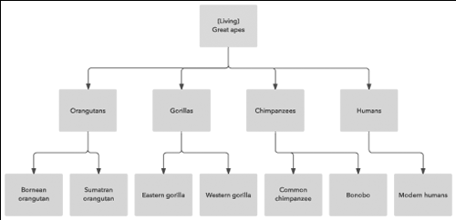

### Présentation

Le modèle de données hiérarchique organise les données en une structure en arbre où chaque enregistrement a un seul
parent, mais peut avoir plusieurs enfants. Initialement utilisé dans les premiers systèmes de gestion de bases de
données, ce modèle est simple et permet une navigation rapide à travers les structures.

### Utilité dans le Développement Logiciel

#### Organisation des Données :

Les données sont structurées de manière hiérarchique, ce qui est particulièrement utile pour représenter des
informations organisées naturellement sous cette forme, comme les structures d'entreprise, les catégories de produits,
ou les dossiers et sous-dossiers sur un système de fichiers.

#### Requêtes Rapides :

La navigation et les requêtes peuvent être très rapides si les relations parent-enfant sont clairement définies, car le
chemin d'accès à chaque noeud est unique.

### Symboles

Les symboles utilisés dans le modèle hiérarchique incluent principalement les noeuds et les liens qui les connectent.
Chaque noeud représente un enregistrement ou un objet, et les liens représentent les relations de parenté à enfant.

## 07b. Modèle Relationnel

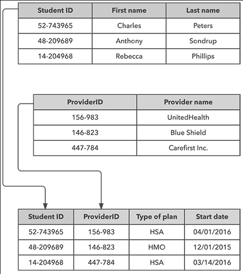

### Présentation

Le modèle relationnel, proposé par Edgar F. Codd, organise les données en tables (ou relations) composées de lignes et
de colonnes. Chaque table représente un type d'entité, et chaque ligne (ou tuple) une instance de cette entité. Les
relations entre les tables sont gérées par des clés étrangères.

### Utilité dans le Développement Logiciel

#### Flexibilité des Requêtes :

Grâce à l'algèbre relationnelle et au SQL, ce modèle offre une grande flexibilité pour écrire des requêtes complexes et
réaliser des jointures entre tables.

#### Intégrité des Données :

Le modèle relationnel permet une gestion efficace de l'intégrité des données à travers des contraintes de clés primaires
et étrangères.

### Symboles

Les symboles principaux incluent les rectangles représentant les tables, et les lignes qui relient ces tables pour
indiquer les relations. Les clés primaires et étrangères sont souvent mises en évidence dans les schémas.

## 07c. Modèle Réseau

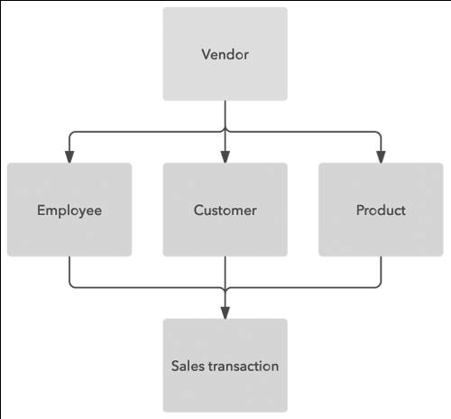

### Présentation

Le modèle de données réseau est une extension du modèle hiérarchique où chaque enregistrement peut avoir plusieurs
parents. Ce modèle permet une plus grande flexibilité par rapport au modèle strictement hiérarchique.

### Utilité dans le Développement Logiciel

#### Flexibilité des Relations :

Les relations complexes entre enregistrements peuvent être plus naturellement modélisées, ce qui est utile pour des
applications nécessitant de multiples relations entre les données, comme les systèmes de réservation ou les réseaux
sociaux.

### Symboles

Comme pour le modèle hiérarchique, les symboles comprennent des noeuds et des connexions, mais avec la possibilité de
multiples connexions entrantes pour chaque noeud, reflétant la structure de réseau.

## 07d. Modèle Document

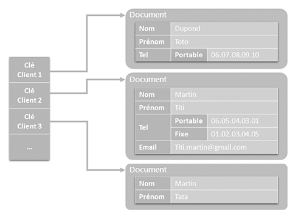

### Présentation

Le modèle de données basé sur des documents stocke les informations sous forme de documents (souvent formatés en JSON ou
XML). Chaque document peut contenir une structure de données complexe avec des champs imbriqués.

### Utilité dans le Développement Logiciel

#### Souplesse de Schéma :

Le modèle document est très flexible, permettant des modifications de schéma sans interruption de service, idéal pour
les applications nécessitant une évolution rapide et des structures de données variées.

### Symboles

Les documents sont souvent représentés par des icônes ressemblant à des documents ou des fichiers, avec des liaisons
entre eux pour montrer les relations imbriquées ou les références.

## 07e. Modèle Entité / Association

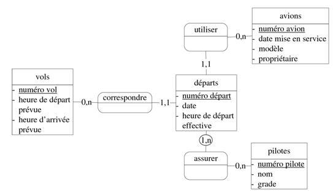

## Présentation

- **Origine :** Le modèle EA, souvent utilisé dans la méthode MERISE, a été développé en France dans les années 1970.
  MERISE est une méthode d'analyse et de conception des systèmes d'information qui utilise le modèle EA pour représenter
  les données.
- **Objectif :** Le modèle EA vise à fournir une représentation claire et simple des données et des relations dans un
  système d'information, en se concentrant sur les entités et leurs associations.

### Symboles

Les entités sont représentées par des rectangles, et les associations par des lignes les reliant, souvent avec des
labels pour décrire la nature de la relation. Les attributs peuvent être listés dans ou autour des rectangles d'entité.
Ce modèle utilise des bulles pour représenter les associations entre entités. Les cardinalités sont souvent notées sous
la forme "1,n".

## 07f. Modèle Entité / Relation

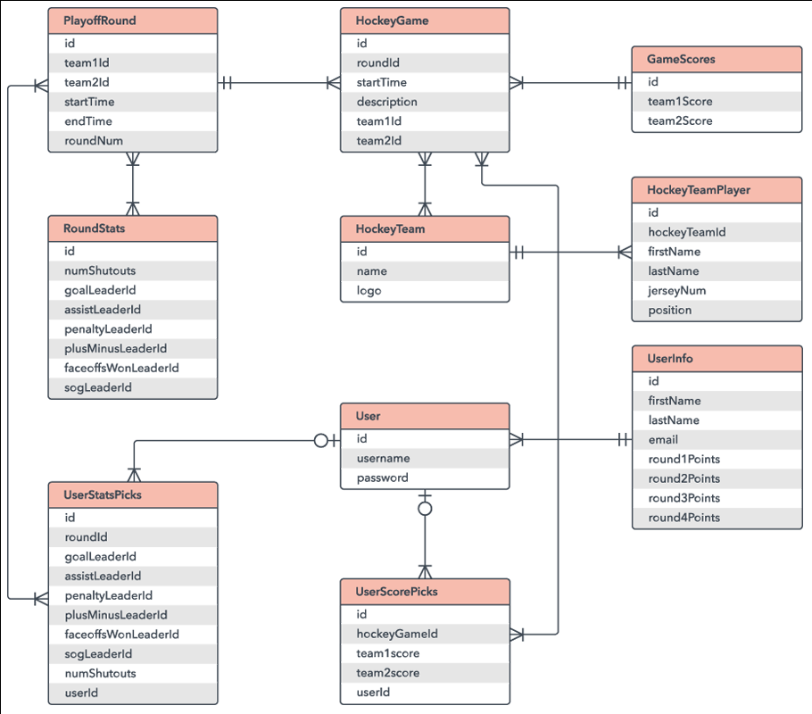

## Présentation

- **Origine :** Le modèle ER a été introduit par Peter Chen en 1976 dans son article "The Entity-Relationship Model -
  Toward a Unified View of Data". Ce modèle est devenu largement adopté dans le monde entier pour la modélisation des
  bases de données relationnelles.
- **Objectif :** Le modèle ER vise à fournir une représentation graphique plus structurée et formelle des entités, des
  attributs et des relations dans une base de données.

### Symboles

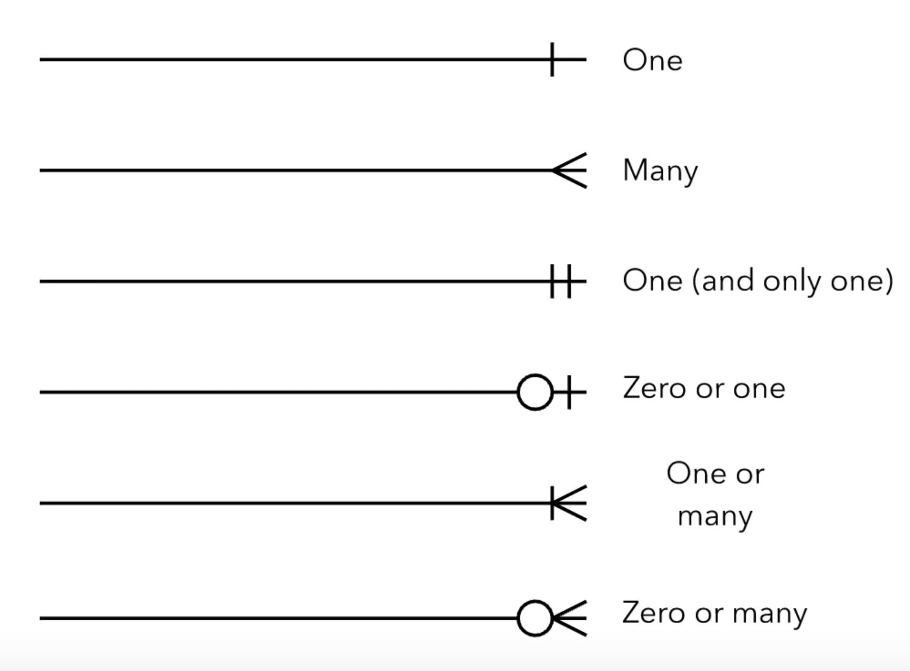

Le modèle ER utilise des traits verticaux, des pattes d'oie, et des ronds pour indiquer les cardinalités des relations
entre les entités.

## Les modèles suivants sont des dérivés, ils n'appartiennent pas à UML

### 07g. Modèle Clé-valeur

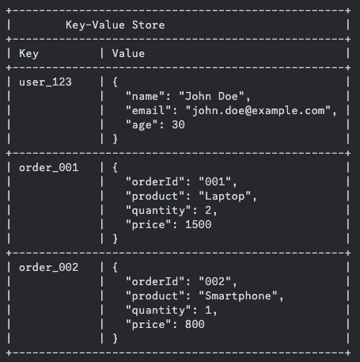

Une base de données clé-valeur est un type de base de données NoSQL où chaque donnée est stockée sous la forme d'une
paire clé-valeur. Ce modèle est extrêmement simple mais très puissant pour des opérations rapides de lecture/écriture.

#### Description du Schéma

- **Clé (Key)** : Une clé unique identifie chaque paire clé-valeur. La clé peut être un identifiant utilisateur (
  user_123), un identifiant de commande (order_001), etc.
- **Valeur (Value)** : La valeur associée à la clé peut être une chaîne de caractères, un nombre, un tableau, ou un
  objet (souvent au format JSON). La valeur contient les données réelles.

#### Exemples de Cas d'Utilisation

- **Stockage de Sessions Utilisateur** : Enregistrer les informations de session des utilisateurs dans une application
  web.
- **Cache de Données** : Stocker des résultats de requêtes pour une récupération rapide.
- **Stockage de Configuration** : Enregistrer les paramètres de configuration d'une application.

#### Avantages

- **Simplicité** : Modèle de données simple et facile à comprendre.
- **Performance** : Excellente performance pour les opérations de lecture/écriture rapides.
- **Flexibilité** : Aucune contrainte de schéma, permettant une grande flexibilité dans le stockage des données.

#### Limites

- **Requêtes Complexes** : Pas conçu pour des requêtes complexes ou des relations entre les données.
- **Évolutivité des Données** : Peut devenir difficile à gérer si les données deviennent trop complexes et interreliées.

### 07h. Modèle en Colonne

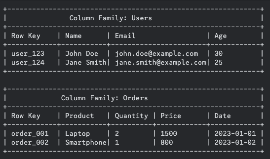

Une base de données orientée colonne est un type de base de données NoSQL où les données sont stockées par colonnes
plutôt que par lignes. Cela permet une lecture rapide et efficace des données lorsque des opérations analytiques sur un
grand nombre de lignes mais un petit nombre de colonnes sont requises.

#### Description du Schéma

- **Column Family** : Une collection logique de colonnes, similaire à une table dans une base de données relationnelle.
    - **Users** : Une column family pour stocker les informations des utilisateurs.
    - **Orders** : Une column family pour stocker les informations des commandes.
- **Row Key** : Une clé unique qui identifie chaque ligne au sein d'une column family.
    - **Exemples** : user_123, user_124 pour les utilisateurs; order_001, order_002 pour les commandes.
- **Colonnes** : Chaque column family contient des colonnes qui stockent les valeurs des données.
    - **Users** : Colonnes Name, Email, Age.
    - **Orders** : Colonnes Product, Quantity, Price, Date.

#### Exemples de Cas d'Utilisation

- **Analyse de Données Massives** : Optimisé pour les requêtes analytiques sur de grands volumes de données.
- **Systèmes de Recommandation** : Stockage et accès rapides aux données comportementales des utilisateurs.
- **Entreposage de Données** : Idéal pour les entrepôts de données et les systèmes OLAP (Online Analytical Processing).

#### Avantages

- **Efficacité de Lecture** : Très efficace pour les opérations de lecture sur des colonnes spécifiques,
  particulièrement avantageux pour les requêtes de type analytique.
- **Compression** : Meilleure compression des données car les colonnes similaires sont stockées ensemble.
- **Scalabilité Horizontale** : Conçu pour être facilement évolutif horizontalement en ajoutant plus de nœuds.

#### Limites

- **Complexité des Requêtes** : Moins adapté pour les requêtes complexes qui nécessitent des jointures entre plusieurs
  tables
  ou column families.
- **Modélisation des Données** : Peut nécessiter une planification minutieuse de la modélisation des données pour
  maximiser les avantages.

### 071. Modèle en Graphe

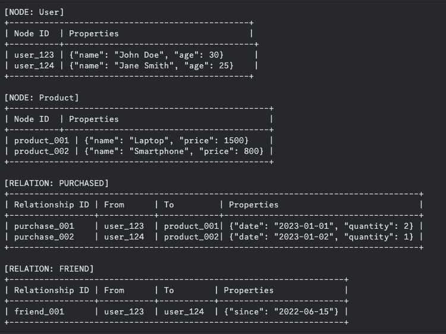

Une base de données orientée graphe est conçue pour représenter les relations entre les données sous forme de graphes,
avec des nœuds (entités), des arêtes (relations) et des propriétés (attributs des nœuds et des arêtes). Cela permet une
navigation et des requêtes rapides sur des relations complexes.

#### Description du Schéma

- **Nœuds (Nodes)** : Les entités principales du graphe, telles que les utilisateurs et les produits.
    - **User Nodes** : Représentent des utilisateurs avec des propriétés comme le nom et l'âge.
    - **Product Nodes** : Représentent des produits avec des propriétés comme le nom et le prix.
- **Arêtes (Edges/Relationships)** : Les relations entre les nœuds, qui peuvent avoir leurs propres propriétés.
    - **Purchased Relationship** : Représente une relation d'achat entre un utilisateur et un produit, avec des
      propriétés comme la date et la quantité.
    - **Friend Relationship** : Représente une relation d'amitié entre deux utilisateurs, avec une propriété indiquant
      la date de début de l'amitié.
- **Propriétés (Properties)** : Attributs des nœuds et des relations, stockés sous forme de paires clé-valeur.

#### Exemple de Cas d'Utilisation

- **Réseaux Sociaux** : Modéliser les utilisateurs et leurs relations (amis, abonnements, etc.).
- **Recommandations de Produits** : Basé sur les achats et les relations entre les utilisateurs.
- **Détection de Fraude** : Identifier des motifs de fraude à travers les relations complexes entre les entités.

#### Avantages

- **Navigation Rapide des Relations** : Permet de traverser rapidement les relations complexes entre les données.
- **Flexibilité des Schémas** : Facile à ajouter de nouveaux types de nœuds et de relations sans restructurer la base de
  données.
- **Analyses Complexes** : Parfait pour des analyses complexes comme les graphes de connaissances, les réseaux sociaux
  et les
  systèmes de recommandation.

#### Limites

- **Performance** : Peut être moins performant pour les opérations massives de lecture/écriture non relationnelles.
- **Complexité** : Modélisation et requêtes peuvent être plus complexes comparées à d'autres types de bases de données
  NoSQL.

#### Exemple Pratique avec Cypher (langage de requête pour Neo4j)

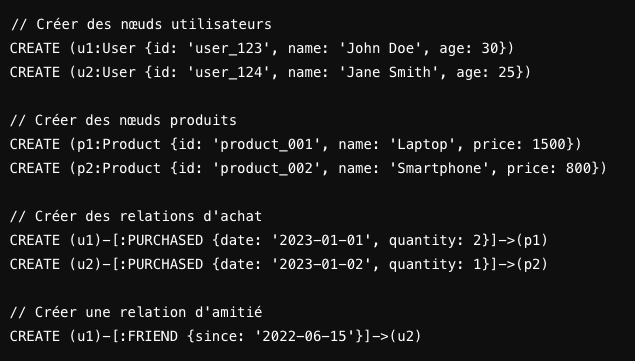

## Exercices pratiques

### [Système de Gestion Universitaire](../Exercices/%C3%89nonc%C3%A9/07a%20-%20Mod%C3%A8le%20Entit%C3%A9-Relation%20-%20Exercice.md)

### [Plateforme de Gestion d'Événements](../Exercices/%C3%89nonc%C3%A9/07b%20-%20Mod%C3%A8le%20Entit%C3%A9-Relation%20-%20Exercice.md)
